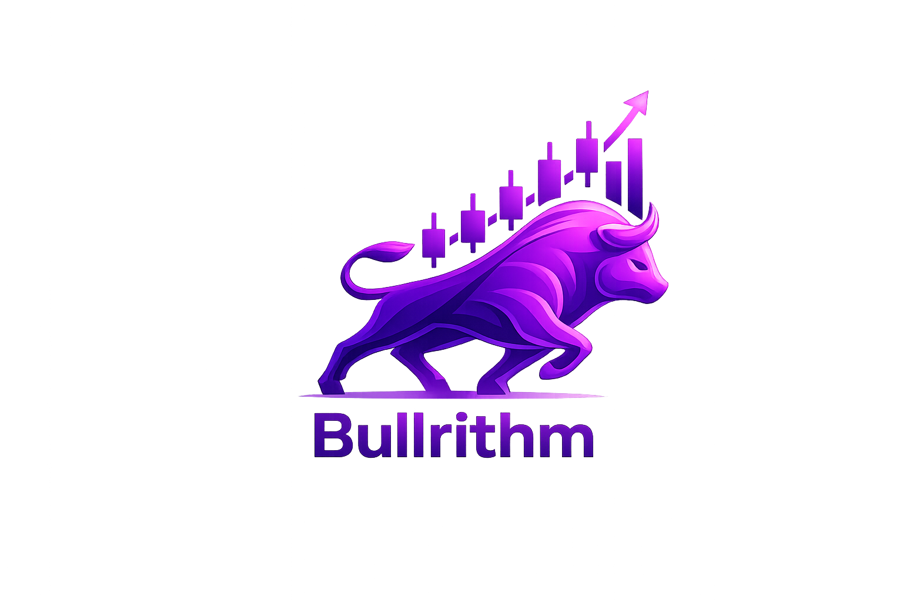

<table>
  <tr>
    <td width="40%" align="left">
      
    </td>
    <td width="60%" align="right">
      
    </td>
  </tr>
</table>

# Bullrithm

Bullrithm adalah aplikasi Flutter untuk memantau saham, membaca market news sentiment, dan melihat detail emiten.

## Ringkasan Aplikasi

- Menampilkan top gainers, top losers, dan most active di page stocks
- Halaman detail saham (price chart, metrik perusahaan, deskripsi, tautan website)
- Market News & Sentiment dengan filter lokal (tanpa nembak API ulang saat filter berubah).
- About Me dapat dipersonalisasi (nama, bio, foto) sepenuhnya client-side.
- Splash screen lalu ada navigasi ke tab utama.

## Library / Third-Party Yang Digunakan

- `http`: komunikasi HTTP ke proxy/Alpha Vantage.
- `shared_preferences`: simpan cache response, preferensi tema, dan data profil lokal.
- `image_picker`: memilih/mengganti foto profil dari galeri.
- `url_launcher`: membuka tautan eksternal (mis. website perusahaan, artikel berita).
- `google_fonts`: konsistensi tipografi UI.
- Cloudflare Workers (`cloudflare/worker.js`): proxy server-side + cache edge + proteksi API key (percobaan)

## Menjalankan Project

1. Install dependency:

```bash
flutter pub get
```

2. Buat file `.env` (contoh):

```env
ALPHA_VANTAGE_PROXY_URL=https://<your-worker>.workers.dev/query
ALPHA_VANTAGE_API_KEY=YOUR_KEY
```

3. Jalankan:

```bash
flutter run --dart-define-from-file=.env
```

## Referensi

- Flutter Docs: https://docs.flutter.dev/
- Alpha Vantage API Docs: https://www.alphavantage.co/documentation/
- Cloudflare Workers Docs: https://developers.cloudflare.com/workers/
- Package `http`: https://pub.dev/packages/http
- Package `shared_preferences`: https://pub.dev/packages/shared_preferences
- Package `image_picker`: https://pub.dev/packages/image_picker
- Package `url_launcher`: https://pub.dev/packages/url_launcher
- Package `google_fonts`: https://pub.dev/packages/google_fonts

## Lesson Learned

Selama pembuatan Bullrithm, pelajaran yang paling penting syaa dapatkan adalah bahwa desain arsitektur data jauh lebih menentukan stabilitas aplikasi dibanding sekadar mempercantik UI. Tantangan terbesar yang saya rasakan adalah limit request dari Alpha Vantage (25 request/day untuk free tier). Solusi efektifnya bukan “retry terus”, tetapi mengurangi frekuensi call dari awal sampai akhir: route semua request ke Cloudflare Worker, aktifkan edge cache di Worker (proxy penuh + worker cache di cloudflare langsung) , lalu tambah cache client-side dengan **shared_preferences** agar data tetap bisa dipakai setelah app restart. Cara ini saya coba implementasikan agar api key tersimpan dengan lebih aman, bisa ngasih rate limit dan rotate keynya tanpa rilis ulang ulang app-nya. Nah itu sih id-nya namun saat implementasi saya terkena kesulitan dimana api yang datang dari worker selalu saja terkena limit request apapun cara yang saya pakai untuk scriptnya entah itu di cache disana atau di limit endpoint yang ditembak tetap saja sama (ragebait nih) yang mana pada akhirnya saya tambahkan implementasi yang biasa saja dimana saya taruh api key-nya client side yang mana ini tidak aman namun apa boleh buat hehe. Nah karena keterbatasan api request yang mana saya sebutkan tadi masalahnya, ini jadinya saya harus menghemat pemanggilan api yang dibutuhkan dimana saya harus memikirkan desain fitur yang mana dan flow yang akan menghemat pemanggilan api namun tetap berfungsi sebagaimana intended. Salah satu contohnya filtering di news yang mana itu filtering lokal saja. selain itu di mobile app ini saya ada implementasi cache menggunakan shared_preferences dengan strategi TTL, jadi data yang masih valid tidak selalu meminta ulang ke server. Pendekatan ini cukup efektif untuk memperkecil konsumsi API dan menjaga performa aplikasi tetap reponsif. Untuk dari UI-nya sendiri karena sudah sempat pernah membuat aplikasi berbasis mobile baik di Mata kuliah PBP ataupun di lomba jadi ada pengalaman yang cukup. Saya juga membuat komponen komponen UI secara cukup modular walau masih ada yang agak kurang (setidaknya tidak ada yang terlalu bloated karena udh ada yang di refactor juga), sehingga proses saat pengembangannya jadi lebih terstruktur.
